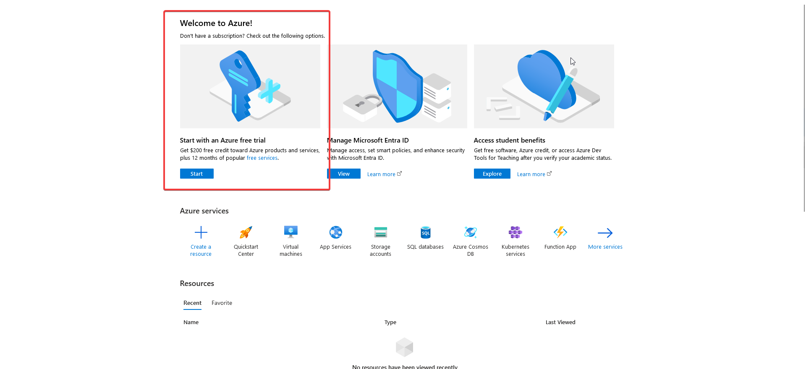
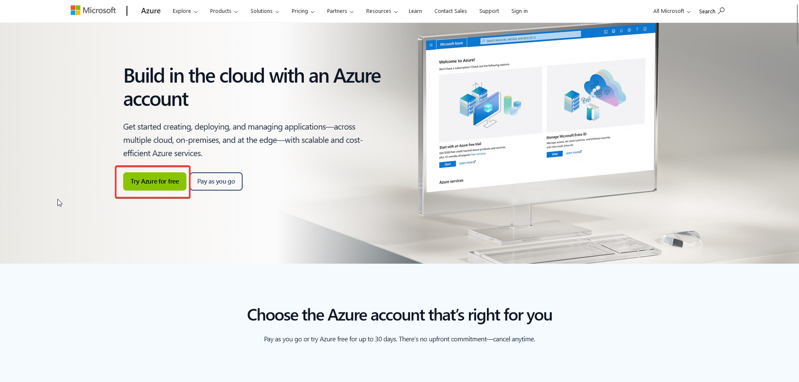
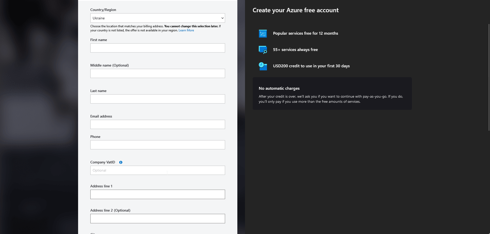

# DevOps for IT Marathon Project

This directory contains the DevOps components for the IT Marathon project, focusing on infrastructure as code and deployment automation.

## Overview

The DevOps setup for this project includes:

1. Infrastructure as Code (IaC) using Terraform
2. Continuous Integration and Continuous Deployment (CI/CD) using Azure DevOps
3. Monitoring and logging setups

## Prerequisites

1. Sign up to [Azure Portal](https://azure.microsoft.com/en-in/pricing/purchase-options/azure-account?icid=azurefreeaccount).

2. Start Azure free trial.

Fill out and submit the form:

If you get this screen, try another credit card (not yours)

## Components

### Terraform Infrastructure

The `terraform/` directory contains all the Terraform configurations for provisioning and managing the Azure infrastructure for the IT Marathon project. This includes:

- Virtual Network setup
- Security configurations
- Database provisioning
- Storage accounts
- App Services for .NET and Python applications
- Monitoring solutions including Grafana

For detailed information on the Terraform setup, including how to configure, deploy, and manage the infrastructure, please refer to the [Terraform README](terraform/README.md).

### CI/CD with Azure DevOps

Our project uses Azure DevOps for Continuous Integration and Continuous Deployment. The CI/CD pipeline automates the build, test, and deployment processes for both the infrastructure and application code.

Key features of our CI/CD setup:

1. **Source Control**: The project code is hosted in Azure DevOps Repos.
2. **Build Pipelines**: Automated build processes for both the .NET and Python applications.
3. **Release Pipelines**: Automated deployment to different environments (e.g., development, staging, production).
4. **Infrastructure as Code**: Terraform configurations are automatically applied as part of the pipeline.
5. **Quality Gates**: Automated testing and code quality checks before deployment.

To access the Azure DevOps project:

1. Navigate to the Azure DevOps portal (https://dev.azure.com/)
2. Select the IT Marathon project
3. Access the Pipelines section to view and manage CI/CD processes

For detailed information on the CI/CD setup or to make changes to the pipelines, please refer to the project's Azure DevOps documentation.

### Monitoring

Monitoring is set up using Grafana dashboards deployed on a dedicated VM. The Terraform configurations include setups for:

- A monitoring VM
- Grafana installation and configuration
- Custom dashboards for various Azure resources

## Getting Started

To get started with the DevOps components of this project:

1. Ensure you have access to the Azure DevOps project
2. Clone the repository from Azure DevOps Repos
3. For local development and testing of Terraform configurations:
   - Navigate to the `terraform/` directory
   - Follow the instructions in the [Terraform README](terraform/README.md)
4. To make changes to the CI/CD pipelines, use the Azure DevOps web interface or edit the pipeline YAML files in the repository
